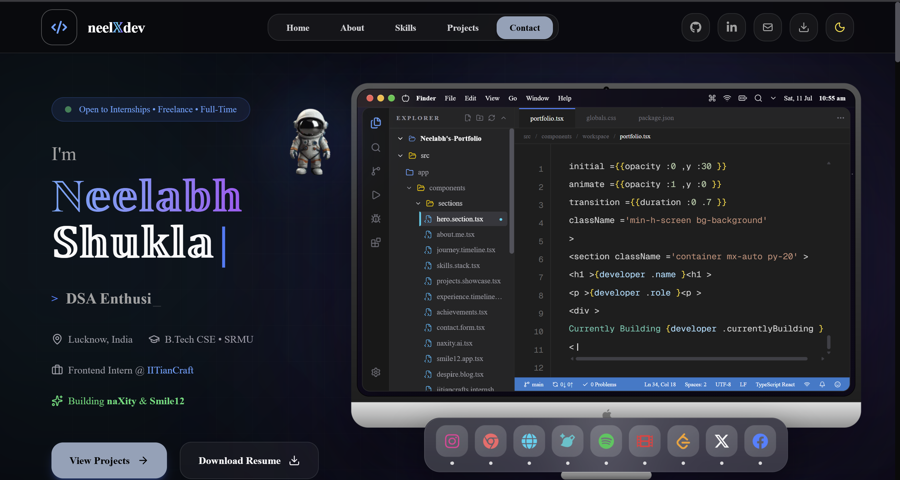
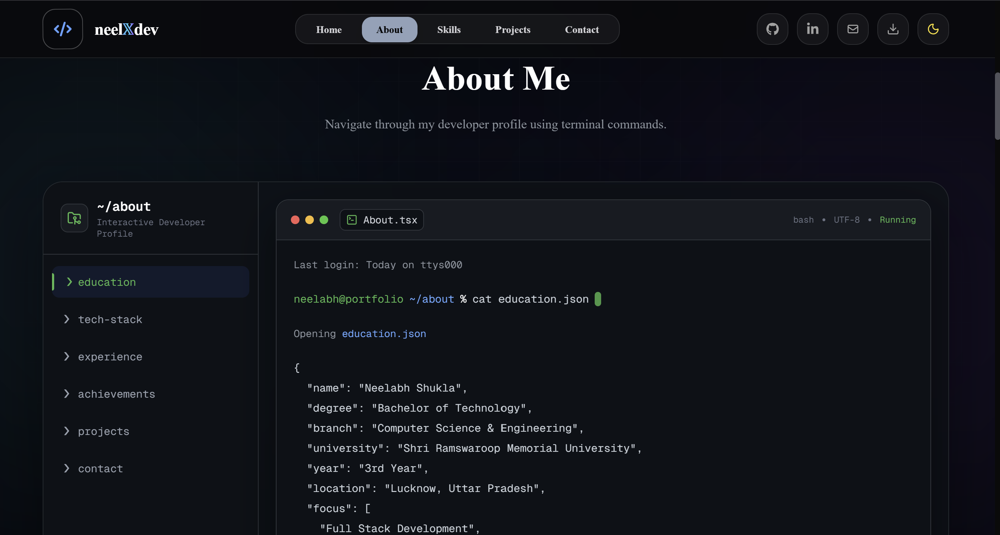
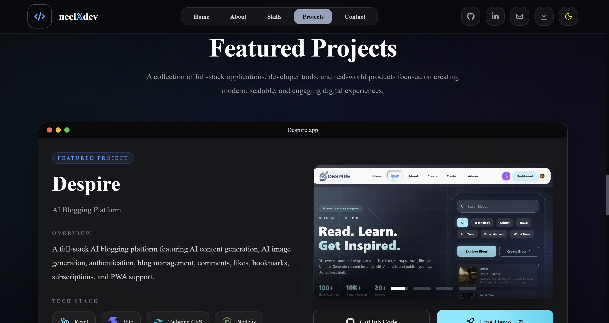
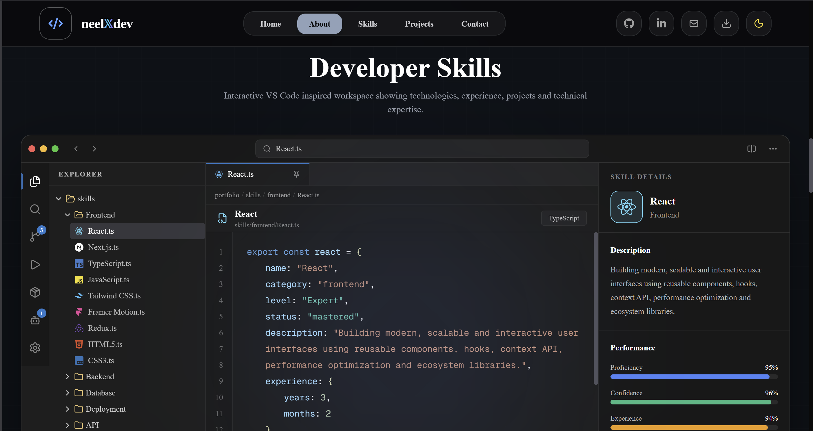

<div align="center">

# 👨‍💻 Neelabh Shukla

### Full Stack Developer • Open Source Contributor • UI/UX Enthusiast

Building modern, scalable, and interactive web applications with a passion for creating exceptional user experiences.

<p align="center">
  <a href="https://github.com/neelabhshukla018">
    
  </a>
  <a href="https://www.linkedin.com/in/neelabh18shukla/">
    
  </a>
  <a href="https://neel-xdev-ipu2.vercel.app/">
    
  </a>
  <a href="mailto:neelabhshukla79@gmail.com">
    
  </a>
</p>

</div>

---

# 🚀 About This Portfolio

Welcome to my personal portfolio!

This portfolio is designed as an immersive **VS Code-inspired developer workspace**, showcasing my skills, projects, experience, and passion for creating modern, scalable, and visually engaging web applications.

It reflects my journey as a developer while demonstrating clean architecture, premium UI design, smooth animations, and performance-focused development.

---

# ✨ Highlights

- 💻 VS Code Inspired Developer Workspace
- 🎨 Premium Glassmorphism UI
- 🌙 Dark & Light Mode
- ⚡ Built with Next.js 16 & TypeScript
- 🎭 Framer Motion Animations
- 📱 Fully Responsive
- 🧠 Interactive Skills Visualization
- 🚀 Beautiful Project Showcase
- 📬 Contact Form with EmailJS
- 📈 Optimized Performance
- ♿ Accessibility Friendly
- 🔍 SEO Optimized

---

# 🖼️ Portfolio Preview

<div align="center">

| Home | About |
|:---:|:---:|
|  |  |

| Projects | Skills |
|:---:|:---:|
|  |  |

</div>

---

# 🛠️ Tech Stack

### Frontend

- Next.js 16
- React 19
- TypeScript
- Tailwind CSS
- Framer Motion
- Lucide React

### Backend

- Node.js
- Express.js
- Prisma ORM

### Database

- PostgreSQL
- MongoDB

### Tools

- Git
- GitHub
- VS Code
- Figma
- Vercel
- EmailJS

---

# ✨ Features

- Interactive Hero Section
- VS Code Inspired Layout
- Animated Developer Workspace
- Dynamic About Section
- Experience Timeline
- Interactive Skills Visualization
- Modern Project Showcase
- Smooth Animations
- Contact Form
- Fully Responsive
- SEO Friendly
- Fast Performance
- Clean & Scalable Architecture

---

# 📁 Folder Structure

```bash
portfolio/
│
├── readme_ss/
│   ├── home.png
│   ├── About.png
│   ├── Projects.png
│   └── Skills.png
│
├── public/
├── src/
├── package.json
├── tsconfig.json
└── README.md
```

---


# 🌐 Live Demo

### 🚀 https://neel-xdev-ipu2.vercel.app/

---

# 📬 Connect With Me

<p align="center">
<a href="https://github.com/neelabhshukla018">

</a>

<a href="https://www.linkedin.com/in/neelabh18shukla/">

</a>

<a href="mailto:neelabhshukla79@gmail.com">

</a>

<a href="https://neel-xdev-ipu2.vercel.app/">

</a>
</p>

---

<div align="center">

## ⭐ If you like this project, don't forget to star the repository!

It motivates me to build more open-source projects and share my work with the community.

### Made with ❤️ by Neelabh Shukla

</div>
